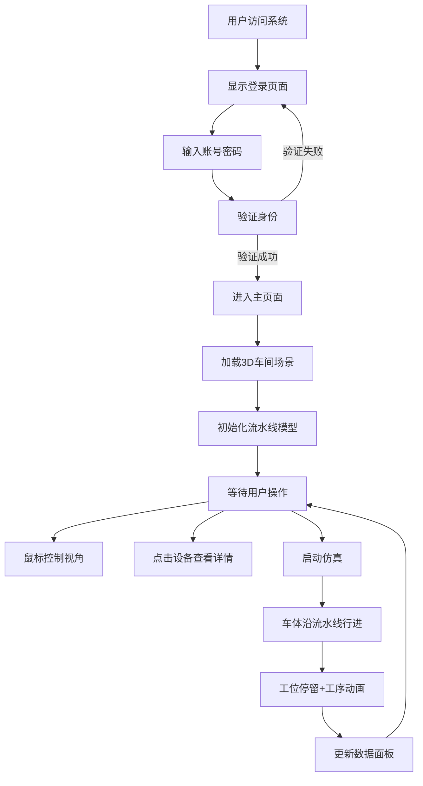

## 1. 产品概述

整车车间流水线3D仿真组态系统是一个面向汽车制造行业的工业可视化平台，通过3D仿真技术实现整车总装车间生产流程的数字化展示与监控。系统旨在为生产管理人员、工程师提供直观的车间运行状态可视化，辅助生产决策与流程优化。

- 主要用途：整车总装车间3D可视化展示、流水线生产仿真、设备状态监控
- 目标用户：汽车制造企业生产管理人员、工艺工程师、运维人员
- 产品价值：提升生产透明度、优化工艺流程、降低培训成本、支撑智能制造转型

## 2. 核心功能

### 2.1 用户角色

| 角色 | 注册方式 | 核心权限 |
|------|----------|----------|
| 管理员 | 系统账号登录 | 完整功能访问、系统配置 |
| 普通用户 | 系统账号登录 | 3D场景浏览、数据查看、仿真控制 |

### 2.2 功能模块

1. **登录页面**：用户身份验证、系统入口
2. **主页面**：3D场景展示、侧边菜单、顶部导航、数据面板
3. **3D场景模块**：车间场景渲染、模型导入、视角控制、设备交互
4. **流水线仿真模块**：车体行进动画、工位工序动画、仿真控制、状态展示
5. **数据面板模块**：产量统计、工位状态、设备信息展示

### 2.3 页面详情

| 页面名称 | 模块名称 | 功能描述 |
|----------|----------|----------|
| 登录页面 | 登录表单 | 账号密码输入、登录验证、记住密码 |
| 主页面 | 顶部导航 | 系统标题、用户信息、消息通知、全屏按钮、退出登录 |
| 主页面 | 侧边菜单 | 功能导航、菜单折叠展开 |
| 主页面 | 3D场景区域 | Three.js渲染、车间场景、模型展示、交互控制 |
| 主页面 | 控制面板 | 仿真启停、暂停、重置、速度调节 |
| 主页面 | 数据面板 | 产量统计、工位状态、设备数量、运行时长 |
| 主页面 | 设备信息弹窗 | 设备详情、状态参数、运行数据 |

## 3. 核心流程

### 3.1 主流程描述

用户通过登录页面输入账号密码，系统验证通过后进入主页面。主页面自动加载3D车间场景，用户可通过鼠标操作浏览场景、点击设备查看详情，通过控制面板控制流水线仿真运行，同时可在数据面板查看实时生产数据。

### 3.2 业务流程图

## 4. 用户界面设计

### 4.1 设计风格

- **主色调**：工业深蓝色(#0A1628)作为背景主色，科技蓝色(#1890FF)作为主交互色，警示橙色(#FF8C00)、故障红色(#F5222D)作为状态色，成功绿色(#52C41A)作为运行状态色
- **按钮风格**：扁平化工业风格，直角边框，悬停有轻微发光效果
- **字体**：中文使用"PingFang SC"、"Microsoft YaHei"，数字和英文使用"Roboto Mono"等宽字体
- **布局风格**：暗色工业主题，深色背景配亮色内容，卡片式数据面板，科技感边框
- **图标风格**：线性图标，统一线宽，科技感十足

### 4.2 页面设计概述

| 页面名称 | 模块名称 | UI元素 |
|----------|----------|--------|
| 登录页面 | 登录表单 | 深色背景、渐变装饰、工业风输入框、发光登录按钮、企业Logo |
| 主页面 | 顶部导航 | 深色导航栏、系统标题、状态指示、用户头像下拉菜单 |
| 主页面 | 侧边菜单 | 可折叠侧边栏、图标+文字导航、选中高亮、悬浮效果 |
| 主页面 | 3D场景区域 | 全屏WebGL画布、悬浮控制按钮、状态角标、加载动画 |
| 主页面 | 控制面板 | 半透明玻璃态卡片、播放/暂停/重置按钮、速度滑块、状态指示灯 |
| 主页面 | 数据面板 | 网格布局统计卡片、数字滚动动画、状态彩色指示灯、趋势图表 |
| 主页面 | 设备弹窗 | 模态弹窗、设备参数表格、状态时间线、关闭按钮 |

### 4.3 响应式

- 采用桌面端优先设计，目标分辨率1920x1080
- 支持1280px以上分辨率自适应
- 侧边菜单支持折叠，小屏设备默认折叠
- 3D场景区域随窗口大小自动调整

### 4.4 3D场景设计指引

- **环境与氛围**：工业车间场景，蓝色调冷光照明，模拟工厂荧光灯效果，适当添加体积光效果增强空间感
- **光照设置**：主光源使用DirectionalLight模拟天窗自然光，辅助光源使用PointLight模拟车间照明灯，AmbientLight提供基础环境光
- **相机设置**：PerspectiveCamera，初始视角为车间45度俯视角，fov=60，近裁剪面0.1，远裁剪面1000
- **交互与动画**：OrbitControls控制视角，限制俯仰角避免穿透地面，点击设备使用Tween.js实现高亮动画，流水线传送带动画使用纹理偏移实现
- **后期处理**：添加轻微Bloom效果增强科技感，适当的抗锯齿处理
- **性能预算**：场景总面数控制在10万以内，帧率维持在60fps，使用InstancedMesh优化重复模型渲染

## 5. 非功能性需求

### 5.1 性能需求

- 3D场景渲染帧率≥60fps
- 页面首屏加载时间≤3s
- 模型加载完成时间≤5s
- 操作响应时间≤100ms

### 5.2 兼容性需求

- 支持Chrome 90+、Edge 90+、Firefox 88+浏览器
- 支持WebGL 2.0渲染
