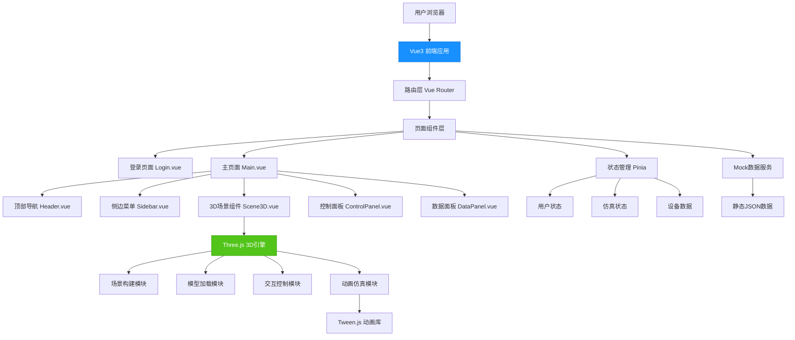

## 1. 架构设计



## 2. 技术描述

- **前端框架**：Vue@3.4 + Vite@5.0 + JavaScript
- **3D引擎**：Three.js@0.160.0 + three/addons/controls/OrbitControls
- **UI组件库**：Element Plus@2.4.0
- **动画库**：@tweenjs/tween.js@21.0.0
- **路由管理**：Vue Router@4.2.0
- **状态管理**：Pinia@2.1.0
- **构建工具**：Vite@5.0.0
- **样式方案**：SCSS + CSS变量
- **数据方案**：Mock静态数据 + 前端模拟
- **开发服务器端口**：5999

## 3. 目录结构

```
project_199/
├── public/
│   └── models/              # 3D模型资源目录
│       ├── car-body.glb
│       ├── robot-arm.glb
│       └── conveyor.glb
├── src/
│   ├── assets/              # 静态资源
│   │   ├── styles/          # 全局样式
│   │   │   ├── index.scss
│   │   │   └── variables.scss
│   │   └── images/          # 图片资源
│   ├── components/          # 公共组件
│   │   ├── Header.vue       # 顶部导航
│   │   ├── Sidebar.vue      # 侧边菜单
│   │   ├── ControlPanel.vue # 仿真控制面板
│   │   ├── DataPanel.vue    # 数据统计面板
│   │   ├── DeviceInfo.vue   # 设备信息弹窗
│   │   └── Loading.vue      # 加载组件
│   ├── views/               # 页面视图
│   │   ├── Login.vue        # 登录页
│   │   └── Main.vue         # 主页面
│   ├── three/               # Three.js相关模块
│   │   ├── Scene3D.js       # 3D场景主类
│   │   ├── models/          # 模型构建类
│   │   │   ├── Workshop.js  # 车间场景构建
│   │   │   ├── CarBody.js   # 车身模型
│   │   │   ├── RobotArm.js  # 机械臂模型
│   │   │   └── Conveyor.js  # 传送带模型
│   │   ├── controls/        # 控制器
│   │   │   └── SceneControls.js # 场景交互控制
│   │   └── animation/       # 动画模块
│   │       ├── Simulation.js # 仿真控制
│   │       └── Animator.js   # 动画管理器
│   ├── router/              # 路由配置
│   │   └── index.js
│   ├── store/               # 状态管理
│   │   ├── index.js
│   │   ├── user.js
│   │   └── simulation.js
│   ├── mock/                # Mock数据
│   │   ├── index.js
│   │   ├── devices.js
│   │   └── production.js
│   ├── utils/               # 工具函数
│   │   ├── three-utils.js
│   │   └── common.js
│   ├── App.vue              # 根组件
│   └── main.js              # 入口文件
├── .trae/
│   └── documents/
│       ├── prd.md
│       └── tech-arch.md
├── index.html
├── vite.config.js
├── package.json
└── README.md
```

## 4. 路由定义

| 路由路径 | 页面名称 | 组件路径 | 说明 |
|----------|----------|----------|------|
| /login | 登录页面 | /src/views/Login.vue | 用户登录入口 |
| /main | 主页面 | /src/views/Main.vue | 3D场景与数据面板 |
| / | 根路径 | - | 重定向到/login |

## 5. 核心数据模型

### 5.1 工位状态数据

```javascript
{
  stationId: 'ST001',
  name: '底盘装配工位',
  status: 'running', // idle/running/stopped
  currentCar: 'CAR001',
  processTime: 45,
  remainingTime: 20,
  equipment: ['ROBOT001', 'ROBOT002'],
  operator: '张三'
}
```

### 5.2 设备数据

```javascript
{
  deviceId: 'ROBOT001',
  name: '焊接机械臂A1',
  type: 'robot-arm',
  status: 'running',
  position: { x: 10, y: 0, z: 20 },
  runtime: 1250,
  efficiency: 98.5,
  temperature: 42,
  lastMaintenance: '2024-01-15'
}
```

### 5.3 生产统计数据

```javascript
{
  date: '2024-06-05',
  plannedOutput: 500,
  actualOutput: 368,
  completionRate: 73.6,
  runningTime: 8.5,
  stopTime: 0.5,
  stations: 12,
  devices: 36
}
```

## 6. 核心技术方案

### 6.1 Three.js 场景架构

采用面向对象的方式封装3D场景：
- `Scene3D` 主类负责场景初始化、渲染循环、资源管理
- 各个模型类（Workshop, CarBody, RobotArm, Conveyor）继承基础模型类
- 使用 `GLTFLoader` 加载GLB模型，程序化生成基础几何模型
- `OrbitControls` 处理视角交互，限制俯仰角范围

### 6.2 流水线仿真方案

- 使用贝塞尔曲线定义车体行进路径
- Tween.js 控制车体沿路径运动和工位停留
- 机械臂动作使用骨骼动画或关节旋转动画
- 状态机管理仿真流程：初始化→行进→工位停留→工序动画→继续行进

### 6.3 2D-3D联动方案

- Pinia 存储设备状态和仿真数据
- 3D场景通过watch监听数据变化更新设备颜色/动画
- 点击3D设备触发事件，更新store并打开信息弹窗
- 数据面板展示store中的实时统计数据

### 6.4 性能优化方案

- 使用 `InstancedMesh` 渲染重复的护栏、货架等模型
- 模型面数优化，车身模型控制在5000面以内
- 阴影映射采用PCFSoftShadowMap，适当降低阴影贴图分辨率
- 非活动状态降低渲染帧率，页面隐藏时暂停渲染
